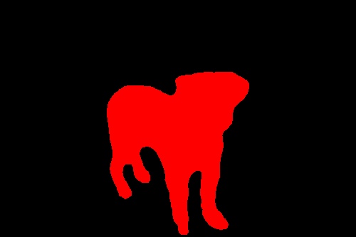
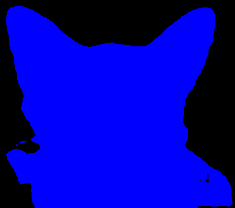

# COMP0197: Applied Deep Learning. Component 2. 2023-24

This repo contains the code for the 2nd component of COMP00197: Applied Deep Learning, implementing and evaluating a self-supervised neural network for semantic segmentation of images. 

We use the following datasets:
* [iNaturalist dataset](https://www.gbif.org/dataset/50c9509d-22c7-4a22-a47d-8c48425ef4a7) for pre-training,
* [Oxford-IIIT Pet](https://www.robots.ox.ac.uk/~vgg/data/pets/) for fine-tuning, 
* [Pascal VOC](http://host.robots.ox.ac.uk/pascal/VOC/) for experiments.

This repo implements existing SOTA [self-supervised](https://github.com/wvangansbeke/Unsupervised-Semantic-Segmentation/tree/main) and [supervised](https://arxiv.org/abs/1511.00561) models for the ablation study. 

## Introduction
Semantic segmentation is an important process in computer vision that partitions images into segments with distinct semantics by making classifications at the pixel level, which enables machines to comprehend images in an efficient manner. As semantic segmentation usually relies on supervised learning methods, it needs labelled datasets, which require tedious and costly data annotation. Self-supervised learning is a promising alternative as it reduces the requirement for extensive annotated datasets.

## Environment and Additional Packages 
Create a PyTorch conda environment using the following command:

```
conda create -n comp0197-cw1-pt -c pytorch python=3.12 pytorch=2.2 torchvision=0.17
```

Additional packages needing installation include:
* pip install torchmetrics
* pip install opencv-python

## Downloads
To run everything, download the data and the results including model checkpoints from [here](https://liveuclac-my.sharepoint.com/:f:/g/personal/ucabfjg_ucl_ac_uk/EnHD2XgkFAZDuyuFPpymdNgBTnSYJkkGJJYe4bEg_ovOsg). 

Copy the data to the directory `~/ADL/pretrain/DATASET`. Ensure that the directory exists by running `mkdir DATASET` while in the ADL project directory.

Similarly, copy the model checkpoints to the directory `~/ADL/RESULTS/CATSNDOGS_supseg_BASNet/checkpoint.pth.tar`.

## The pre-training dataset
### iNaturalist
The iNaturalist dataset is a collection of observations of plants, animals and other living organisms recorded by naturalists worldwide and uploaded to the [iNaturalist platform](https://www.inaturalist.org). It is widely used in computer vision and machine learning for tasks such as fine-grained species classification and self-supervised learning due to its diversity and size.

#### Cats and Dogs 
For the base model training, we use ~10k dogs, ~10k cats (named CATSNDOGS) (research-grade), obtained from the platform via [Python API](https://pypi.org/project/pyinaturalist/0.12.0/).

#### iNaturalist mini 2021 20k subsample
For experiments, we use a subset of 20k randomly sampled images from the 'mini' 2021 dataset to avoid class imbalance,  downloaded via PyTorch's [__torchvision.datasets__](https://pytorch.org/vision/stable/generated/torchvision.datasets.INaturalist.html#torchvision.datasets.INaturalist) module. 

The following experiment datasets were created and are in the download:
* CATSNDOGS: Original images from the iNaturalist dataset, split for cats and dogs, with BASNet masks. 
* CATSNDOGS_PICANET: Original images from the iNaturalist dataset, split for cats and dogs, with PiCANet masks. 
* IMAGENET_SAMPLE: A sample of the iNaturalist dataset (20k) with BASNet masks. 
* IMAGENET_SAMPLE_PICANET: A sample of the iNaturalist dataset (20k) dataset with PiCANet masks.
* oxford-iiit-pet: Oxford-IIIT Pet dataset with a 80/20 split for train/val. 
* oxford-iiit-pet-50: Oxford-IIIT Pet dataset with a 50/50 split for train/val. 
* oxford-iiit-pet-70: Oxford-IIIT Pet dataset with a 70/30 split for train/val. 

## Self-Supervised Model  
### Generating the saliency masks
There are two approaches for generating saliency masks, which are used as a pixel-grouping prior for the MaskContrast loss. 

#### Supervised saliency
We use a BASNet saliency model that has been pretrained through supervised methods to generate saliency masks directly. The open-source code to generate masks is available [here](https://github.com/xuebinqin/BASNet). 

We also use the PiCANet saliency model, which open-source code is available [here](https://github.com/Ugness/PiCANet-Implementation). 

#### Unsupervised saliency
For one of our OEQ experiments, we use two existing models pretrained on Pascal VOC using [supervised](https://drive.google.com/file/d/1UkzAZMBG1U8kTqO3yhO2nTtoRNtEvyRq/view) and [unsupervised](https://drive.google.com/file/d/1efL1vWVcrGAqeC6OLalX8pwec41c6NZj/view) saliency masks to assess the performance of transfer learning. 

The unsupervised saliency estimator model, [DeepUSPS](https://arxiv.org/abs/1909.13055), is used to create saliency masks. The generated masks are utilised as a pseudo-ground-truth to train the BASNet model, which is then used to compute saliency masks on the target dataset.


### Training 
Configuration files tailored for different experiments are organised into specific folders as follows:

* Pretraining Configurations Folder: ~/ADL/pretrain/configs/
* Fine-tuning Configurations Folder: ~/ADL/segmentation/configs/linear_finetune/

#### Pretraining 
To perform pretraining:
1. Configure the results directory: specify the absolute path where the results for each experiment will be saved. Edit the `root_dir` line in the `env.yml` file to match your designated results directory. The `env.yml` file is located in the pretraining configurations folder.

We will use the following results path in the following instructions
```
root_dir: ~/ADL/RESULTS
```

2. Once the `root_dir` is correctly set, you can initiate pretraining by specifying which configuration files to use. This should be set using the `--config_exp` argument. 

Pretraining is run via: 
```
cd pretrain
python main.py --config_env configs/env.yml --config_exp configs/CATSNDOGS_supseg_BASNet.yaml
```
You may substitute `CATSNDOGS_supseg_BASNet` for any pretraining dataset.

#### Finetuning 
We use the linear classifier for finetuning. We freeze the weights of the pre-trained model apart from one and train it (1 x 1) convolutional layer to predict the class assignments from the generated feature representations.

To perform finetuning:
1. Configure the results directory: specify the absolute path where the results for each experiment will be saved. Edit the `root_dir` line in the `env.yml` file to match your designated results directory. The `env.yml` file is located in ~/ADL/segmentation/configs/. 

We use the same results directory as before
```
root_dir: ~/ADL/RESULTS
```

2. Set model checkpoint path: update the path to the model checkpoint in each configuration file intended for fine-tuning. The configuration files are located in the `linear_finetune` directory. If you haven't completed pretraining, use an existing checkpoint file from the downloads section.
   
```
pretraining: '~/ADL/RESULTS/CATSNDOGS_supseg_BASNet/checkpoint.pth.tar'
```

3. Once both `root_dir` and `pretraining` are set up, you can initiate finetuning by specifying which configuration files to use. This should be set using the `--config_exp` argument. 
   
Finetuning is run via: 
```
cd segmentation
python linear_finetune.py --config_env configs/env.yml --config_exp configs/linear_finetune/lf_pre_CATSNDOGS_supsal.yaml
```
You may select any finetuning config under `ADL/segmentations/configs/linear_finetune/`.

### Evaluation
We adopt a standard evaluation protocol to benchmark our experiments. Our evaluation is focused on using linear probes.

#### Evaluate
The following instructions are for the finetuned model `lf_pre_CATSNDOGS_supsal`, but any finetuned model may be substituted. If you have run the finetuning to evaluate the saved model, run:
```
cd segmentation
python eval.py --config_env configs/env.yml --config_exp configs/linear_finetune/lf_pre_CATSNDOGS_supsal.yaml --state-dict ../RESULTS/lf_pre_CATSNDOGS_supsal/best_model.pth.tar
```
Indicate the path to the best model state dictionary that you want to evaluate under `--state-dict `. If you haven't run the finetuning, you can evaluate one of the model checkpoints.

The evaluation results will be printed to the terminal and saved to the disk. 

#### Visualise the results
The model predictions are located in: 
```
root_dir: ~/ADL/RESULTS name_of_the_model/predictions
```
However, they are invisible to the human eye. To visualise the results, run: 
```
cd segmentation
python visualise.py --pred_path ~/ADL/RESULTS/lf_pre_CATSNDOGS_supsal/predictions
```

Specify the path to the predictions folder under the `--pred_path` tag. 

This will create a new folder, `restored`, containing restored images. Some examples include: 


## Supervised Model 
We used [SegNet](https://arxiv.org/abs/1511.00561) as our supervised model in the ablation study. We compare the MaskContrast model with a fully supervised SegNet with depthwise-separable convolutions, which reduces the model size without trading away too much performance. We train for 20 epochs on the Oxford-IIIT Pet dataset (self-supervised model's finetuning data), adapting the code from [here](https://www.kaggle.com/code/dhruv4930/oxford-iiit-pets-segmentation-using-pytorch).


### Training 
To re-train the model, run the following command in the current working directory `~/ADL/`: 
```
python Supervised-Model/training.py
```

The script automatically loads the Oxford-IIIT Pet dataset into a newly created folder within the current directory (e.g. /oxford_data). It also saves the newly generated model weights to a file in the current directory (e.g., model_weights_ADAM.pth). 

### Evaluation 
To evaluate the saved model, run while in the directory `~/ADL/`:
```
python Supervised-Model/eval.py
```

This will calculate the IoU on the test set. The evaluation results will be printed to the console. 

To change the model that is being evaluated, in eval.py, specify the path to the saved model in this line:  
```
model.load_state_dict(torch.load('model_weights_ADAM.pth', map_location=torch.device('cpu')))
```

