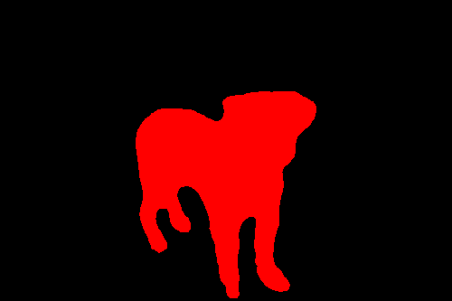

# Environment and Additional Packages 
Create a PyTorch conda environment using the following command:

```
conda create -n comp0197-cw1-pt -c pytorch python=3.12 pytorch=2.2 torchvision=0.17
```

Additional packages needing installing include:
* pip install torchmetrics
* pip install opencv-python

# Running the Code 
## Downloads
To run everything, download the data and the results including model checkpoints from [here](https://liveuclac-my.sharepoint.com/:f:/g/personal/ucabfjg_ucl_ac_uk/EnHD2XgkFAZDuyuFPpymdNgBTnSYJkkGJJYe4bEg_ovOsg). 

Copy the data to the directory `~/ADL/pretrain/DATASET`. Ensure that the directory exists by running `mkdir DATASET` while in the ADL project directory.

Similarly, copy the sample model checkpoint to the directory `~/ADL/RESULTS/CATSNDOGS_supseg_BASNet/checkpoint.pth.tar`.

Following experiment datasets were created and are in the download:
* CATSNDOGS: Original images from the iNaturalist dataset, split for cats and dogs, with BASNet masks. 
* CATSNDOGS_PICANET: Original images from the iNaturalist dataset, split for cats and dogs, with PiCANet masks. 
* IMAGENET_SAMPLE: A sample of the iNaturalist dataset (20k) with BASNet masks. 
* IMAGENET_SAMPLE_PICANET: A sample of the iNaturalist dataset (20k) dataset with PiCANet masks.
* oxford-iiit-pet: Oxford-IIIT Pet dataset with a 80/20 split for train/val. 
* oxford-iiit-pet-50: Oxford-IIIT Pet dataset with a 50/50 split for train/val. 
* oxford-iiit-pet-70: Oxford-IIIT Pet dataset with a 70/30 split for train/val. 

All folders contain the following subfolders: 
* images: original images. 
* saliency_supervised_model: corresponding masks generated by a saliency model (BASNet/PiCANet/DeepUSPS).
* sets: image names for training. 
* splits: image names for validation. 

The dataset is split into training and validation sets using the `split.py` script, which randomly divides the data according to a specified percentage. 

## Self-Supervised Model

### Training 
Configuration files tailored for different experiments are organised into specific folders as follows:

* Pretraining Configurations Folder: ~/ADL/pretrain/configs/
* Fine-tuning Configurations Folder: ~/ADL/segmentation/configs/linear_finetune/

#### Pretraining 
To perform pretraining:
1. Configure the results directory: specify the absolute path where the results for each experiment will be saved. Edit the `root_dir` line in the `env.yml` file to match your designated results directory. The `env.yml` file is located in the pretraining configurations folder.

We will use the following results path in the following instructions
```
root_dir: ~/ADL/RESULTS
```

2. Once the `root_dir` is correctly set, you can initiate pretraining by specifying which configuration files to use. This should be set using the `--config_exp` argument. 

Pretraining is run via: 
```
cd pretrain
python main.py --config_env configs/env.yml --config_exp configs/CATSNDOGS_supseg_BASNet.yaml
```
You may substitute `CATSNDOGS_supseg_BASNet` for any pretraining dataset.

#### Finetuning 
We use the linear classifier for finetuning. We freeze the weights of the pre-trained model apart from one and train it (1 x 1) convolutional layer to predict the class assignments from the generated feature representations.

To perform finetuning:
1. Configure the results directory: specify the absolute path where the results for each experiment will be saved. Edit the `root_dir` line in the `env.yml` file to match your designated results directory. The `env.yml` file is located in ~/ADL/segmentation/configs/. 

We use the same results directory as before
```
root_dir: ~/ADL/RESULTS
```
2. Set model checkpoint path: update the path to the model checkpoint in each configuration file intended for fine-tuning. The configuration files are located in the `linear_finetune` directory. If you haven't completed pretraining, use an exisiting checkpoint file from the downloads section.
   
```
pretraining: '~/ADL/RESULTS/CATSNDOGS_supseg_BASNet/checkpoint.pth.tar'
```

3. Once both `root_dir` and `pretraining` are set up, you can initiate finetuning by specifying which configuration files to use. This should be set using the `--config_exp` argument. 
   
Finetuning is run via: 
```
cd segmentation
python linear_finetune.py --config_env configs/env.yml --config_exp configs/linear_finetune/lf_pre_CATSNDOGS_supsal.yaml
```
You may select any finetuning config under `ADL/segmentations/configs/linear_finetune/`.

### Evaluation 
#### Evaluate 
The following instructions are for the finetuned model `lf_pre_CATSNDOGS_supsal`, but any finetuned model may be substituted. If you have run the finetuning, to evaluate the saved model, run:
```
cd segmentation
python eval.py --config_env configs/env.yml --config_exp configs/linear_finetune/lf_pre_CATSNDOGS_supsal.yaml --state-dict ../RESULTS/lf_pre_CATSNDOGS_supsal/best_model.pth.tar
```
Indicate the path to the best model state dictionary that you want to evaluate under `--state-dict `. If you haven't run the finetuning, to evaluate the saved model use one of the model checkpoints.

The evaluation results will be printed to terminal and saved to the disk. 

#### Visualise the results
The model predictions are located in: 
```
root_dir: ~/ADL/RESULTS name_of_the_model/predictions
```
However, they are invisible to the human eye. To visualise the results, run: 
```
cd segmentation
python visualise.py --pred_path ~/ADL/RESULTS/lf_pre_CATSNDOGS_supsal/predictions
```

Specify the path to the predictions folder under the `--pred_path` tag. 

This will create a new folder, `restored`, containing restored images. Some examples include: 


## Supervised Model 
### Training 
To re-train the model, run the following command in the current working directory `~/ADL/`: 
```
python Supervised-Model/training.py
```

The script automatically loads the Oxford-IIIT Pet dataset into a newly created folder within the current directory (e.g. /oxford_data). It also saves the newly generated model weights to a file in the current directory (e.g., model_weights_ADAM.pth). 

### Evaluation 
To evaluate the saved model, run while in the directory `~/ADL/`:
```
python Supervised-Model/eval.py
```

This will calculate the IoU on the test set. The evaluation results will be printed to the console. 

To change the model that is being evaluated, in eval.py, specify the path to the saved model in this line:  
```
model.load_state_dict(torch.load('model_weights_ADAM.pth', map_location=torch.device('cpu')))
```
